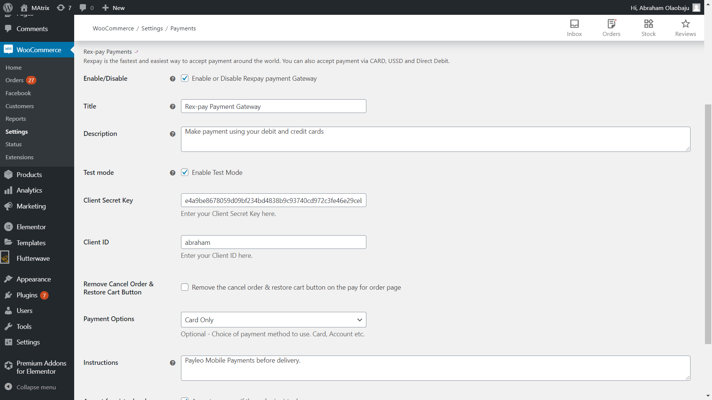
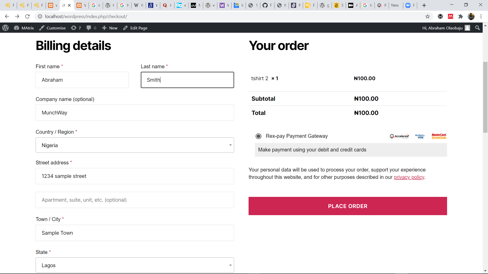
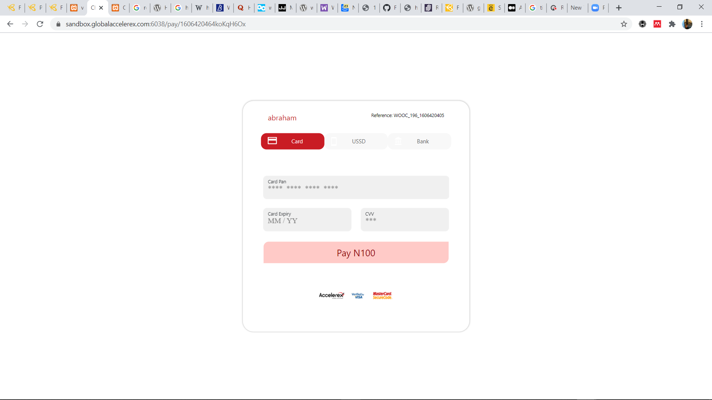
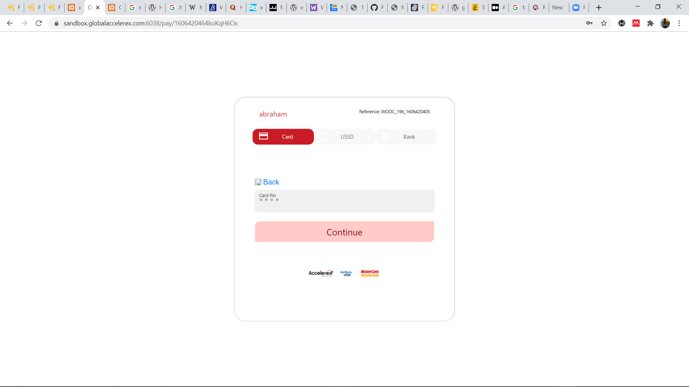

# WooCommerce RexPay Payment Gateway

 - **Contributors:** Workova Developers
 - **Tags:** woocommerce, payment gateway,international, mastercard, visa, rexpay
 - **Requires at least:** 4.4
 - **Tested up to:** 5.4
 - **Stable tag:** 1.0.0
 - **License:** MIT - see below

Make collections on your store using RexPay.

## Description

Accept Credit card, Debit card and Bank account payment directly on your store with the Rex-Pay payment gateway for WooCommerce.

RexPay is available in:

* __Nigeria__

## Installation

### Automatic Installation
*   Login to your WordPress Dashboard.
*   Click on "Plugins > Add New" from the left menu.
*   In the search box type __RexPay Woocommerce Payment Gateway__.
*   Click on __Install Now__ on __RexPay Woocommerce Payment Gateway__ to install the plugin on your site.
*   Confirm the installation.
*   Activate the plugin.
*   Click on "WooCommerce > Settings" from the left menu and click the __"Payments"__ tab.
*   Click on the __Rexpay__ link from the available Checkout Options
*   Configure your __RexPay Payment Gateway__ settings accordingly.

### Manual Installation
*  Download the plugin zip file.
*  Login to your WordPress Admin. Click on "Plugins > Add New" from the left menu.
*  Click on the "Upload" option, then click "Choose File" to select the zip file you downloaded. Click "OK" and "Install Now" to complete the installation.
*  Activate the plugin.
*  Click on "WooCommerce > Settings" from the left menu and click the __"Payments"__ tab.
*  Click on the __RexPay__ link from the available Checkout Options
*  Configure your __RexPay Payment Gateway__ settings accordingly.

For FTP manual installation, [check here](http://codex.wordpress.org/Managing_Plugins#Manual_Plugin_Installation).

### Configure the plugin
To configure the plugin, go to __WooCommerce > Settings__ from the left menu, click __Payments__ tab. Click on __RexPay__.

* __Enable/Disable__ - check the box to enable Rave Payment Gateway.
* __Mode__ - uncheck the box to enable Live Mode.
* __Enter Client SecretKey__ - ensure that client secret key entered is the same with the one supplied to you by Rex-pay.
* __Enter Client ID__ - enter your client ID.
* Click __Save Changes__ to save your changes.

## Screenshots ##

#####1. RexPay WooCommerce Payment Gateway Setting Page
###

#####2. Rex-Pay WooCommerce Payment Gateway on woocommerce order checkout page
###

#####3. Rex-Pay modal showing card payment option
###

#####4. Rex-Pay modal showing account payment option
###

